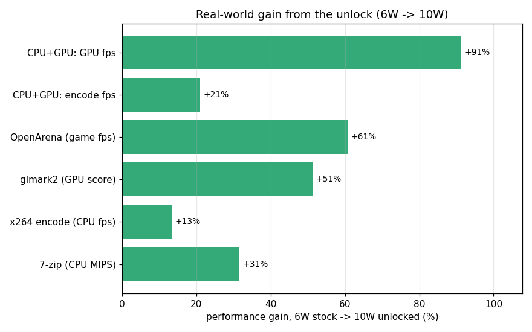
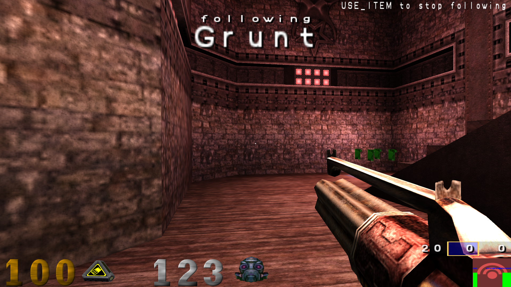
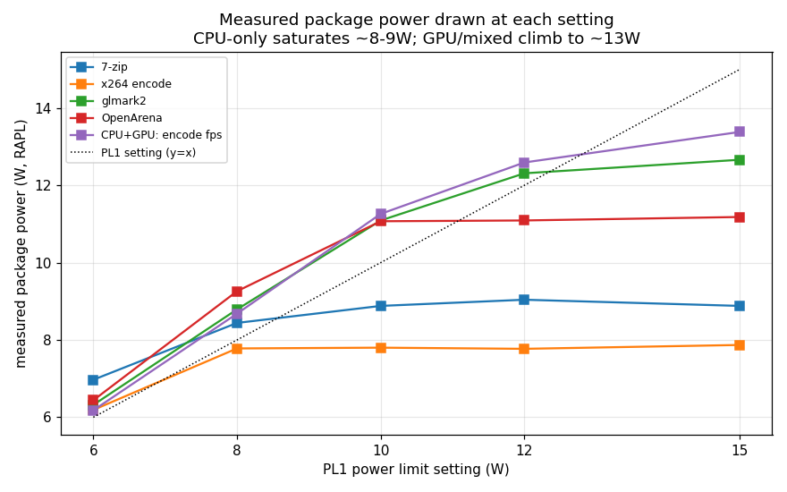

# Real-world benchmarks: 6W vs 8W vs 10W

Measured on the Jumper EZbook (Celeron N3450, Apollo Lake, HD 500) with the
unlock applied at three sustained power limits. Each number is a real workload,
not a synthetic power reading.

## Headline: 6W (stock) → 10W (unlocked)

| Benchmark | What it measures | 6W (stock) | 10W (unlocked) | Gain |
|-----------|------------------|-----------:|---------------:|:----:|
| **OpenArena timedemo** | game fps (follow-bot demo, 1280×720) | 69.1 fps | **111.0 fps** | **+61%** |
| **glmark2** | GPU score (GL scenes) | 205 | **310** | **+51%** |
| **7-zip** | CPU compression (MIPS) | 4858 | **6383** | **+31%** |
| **combined glxgears** | GPU fps while CPU encodes | 134 | **257** | **+91%** |
| **combined x264** | CPU encode fps while GPU busy | 15.3 | **18.5** | **+21%** |
| **x264 encode** | CPU video encode fps | 22.6 | 25.6 | +13% |

The biggest wins are **GPU/game and mixed CPU+GPU** workloads — exactly the cases
that used to be strangled at 6W and which the MSR-lock fix unlocked (see the GPU
latch story in the main README, Act 12).

## What's being benchmarked

The game test is an OpenArena *follow-bot* timedemo — the camera rides the AI
through real combat (note "following Grunt" / the frag messages), so it's
representative gameplay, not a static scene:

The GPU test is glmark2 (the refract scene shown here):

## Full watt ladder

Raw data: [`data/ladder_results.txt`](data/ladder_results.txt). `pkg` = average
package power over the run, `cpu`/`gpu` = average clocks, `tmax` = peak temp.

| Benchmark | metric | 6W | 8W | 10W | 12W | 15W |
|-----------|--------|---:|---:|----:|----:|----:|
| 7-zip | MIPS | 4858 | 6259 | 6383 | 6675 | 6358 |
| x264 encode | fps | 22.6 | 25.6 | 25.6 | 26.1 | 25.6 |
| glmark2 | score | 205 | 263 | 310 | 333 | 330 |
| OpenArena | fps | 69.1 | 95.2 | 111.0 | 111.4 | 110.5 |
| combined x264 | enc fps | 15.3 | 17.1 | 18.5 | 18.7 | **11.7** |
| combined glxgears | fps | 134 | 207 | 257 | 290 | 374 |

6/8/10W measured with the MSR locked at 10W (phase-1, `data/ladder_results.txt`).
12/15W needed the MSR unlocked (reboot + boot service off) with a re-assert daemon
holding it — phase-2, `data/ladder2_results.txt`. The 10W column was re-measured in
phase-2 as a cross-check and matched (glmark2 311 vs 310, OpenArena 110.9 vs 111.0,
combined glxgears 259 vs 257), validating the unlocked+re-assert method.

Measured package power / peak temp at each level (representative):

| Level | CPU bench draw | GPU bench draw | peak temp |
|-------|---------------:|---------------:|----------:|
| 6W | ~6.2–7.0 W | ~6.3–6.4 W | 74 °C |
| 8W | ~7.8–8.4 W | ~8.8–9.3 W | 78 °C |
| 10W | ~7.8–8.9 W | ~11.0–11.3 W | 84 °C |

(TjMax is 105 °C — every run had ≥20 °C of thermal headroom, so results are
power-policy-limited, not thermal.)

## What the curve shows

- **GPU/game workloads scale almost linearly with the limit** (glmark2 +51%,
  OpenArena +61% from 6→10 W) and draw the full budget (11 W at the 10 W setting,
  including PL2 bursts). This is the headline benefit of the fix.
- **CPU-only workloads saturate around 8–9 W.** 7-zip jumps +29% from 6→8 W but
  only +2% more from 8→10 W; x264 is flat 8→10 W. Reason: the all-core turbo
  ratio is capped at 21× ≈ 2.0–2.09 GHz (MSR 0x1AD), and four Goldmont cores at
  that clock only draw ~8–9 W — so beyond ~9 W the CPU is frequency-limited, not
  power-limited. Their `pkg` draw confirms it (7-zip pulls 8.9 W even at the 10 W
  setting, never the full 10 W).
- **Mixed CPU+GPU is where headroom matters most.** With the GPU contending,
  glxgears fps nearly doubled (134→257, +91%) and the simultaneous encode still
  improved +21% — at 6 W the two starve each other down to a shared ~6 W; at 10 W
  they share a 10 W budget.

### Beyond 10W: diminishing — then negative — returns (why 10W is the daily setting)

The phase-2 sweep to 12W and 15W shows 10W is the right place to stop:

- **CPU-only: flat.** 7-zip and x264 don't move from 10→15W — the all-core ratio
  ceiling (2.0–2.09 GHz) is the bottleneck, not power, and they never draw more
  than ~9 W anyway.
- **GPU/game: marginal then plateaued.** glmark2 gains only +7% at 12W (310→333)
  and nothing at 15W (330). OpenArena is already maxed at 10W (111 fps across
  10/12/15W).
- **Mixed: 15W actually backfires.** At 15W the uncapped GPU (glxgears, vsync off)
  grabbed the larger share of the bigger budget — glxgears shot to 374 fps — and
  *starved* the simultaneous CPU encode down to **11.7 fps** (CPU 1117 MHz) from
  18.7 at 12W. With no per-domain (PP0/PP1) limits on this SoC, a higher package
  budget lets whichever side is hungrier dominate; a real game (vsync-capped GPU)
  wouldn't trip this, but it shows more power isn't strictly better for mixed work.
- **Heat for nothing.** Peak temp rose 84 → 87 °C from 10 → 15W for ≤7% gain on
  one benchmark.

**Conclusion: 10W captures essentially all the usable benefit** (CPU ratio-capped,
game maxed) at the lowest temps, which is why the persistent config locks PL1 at
10W rather than higher.

### Did the higher caps actually engage? (measured power)

Yes. The GPU and mixed lines climb past 10W to ~12.7–13.4W — impossible under a
10W ceiling — confirming 12/15W took effect. CPU-only stays pinned at ~8–9W (it's
ratio-limited, not power-limited), and measured power bends *below* the y=x line
past ~12W because nothing on this SoC demands a full 15W. (Power is RAPL; see the
measurement caveats below.)

## Method / reproducibility

- A/B done live without rebooting: the MSR is locked at 10 W, and the PUnit
  enforces `min(MMIO, MSR)`, so setting the **MMIO** limit (`0x70A8`) to 6/8/10 W
  selects the effective cap. `scripts/runladder.sh` drives the three levels;
  `scripts/benchsuite.sh` runs the five benchmarks at the current level.
- **Cooldown** between every benchmark: idle until package temp returns to ≤55 °C
  (idle floor ~52 °C) so each run starts from the same thermal baseline.
- Power = **RAPL** package energy-counter delta over the run wall-time; clocks/temp
  sampled at 2 Hz; peak temp reported. RAPL is the CPU's own model-based estimate
  of *package* power (cores + uncore + iGPU), not an external meter and not wall
  power. It's trustworthy here: at a 6W cap it read 5.99W and at a 10W cap 9.99W
  (matching the programmed PL1 to 0.01W), and because PL2 was held constant (15W)
  across all settings, the rising averages at 12/15W isolate the PL1 change.
- **Independent cross-check attempted and failed:** the battery fuel gauge reports
  static placeholder values on this machine (`ENERGY_NOW == ENERGY_FULL` frozen at
  100%, `POWER_NOW` nailed at 3.8W regardless of load, model "SR Real Battery",
  serial 123456789 — see [`data/batt_results.txt`](data/batt_results.txt)). So no
  software measurement other than RAPL is possible here; a true physical reading
  would need an external inline DC power meter.
- **OpenArena**: a recorded *follow-bot* demo (camera rides the AI through real
  combat — [`data/openarena-benchdemo.dm_71`](data/openarena-benchdemo.dm_71)),
  replayed with `timedemo 1`. Launched with `+set com_crashed 0` so the
  "safe video settings?" prompt never appears — fully unattended.
- 12 W and 15 W (phase-2) required the MSR *unlocked* — the lock clears only on
  reboot, so we disabled the boot service, rebooted, and ran `scripts/runladder2.sh`,
  which sets MMIO+MSR per level and runs `scripts/reassert_msr.py` (rewrites the
  unlocked MSR every 0.8 s so GPU activity can't reset it). The daily 10 W lock was
  re-enabled afterward.
