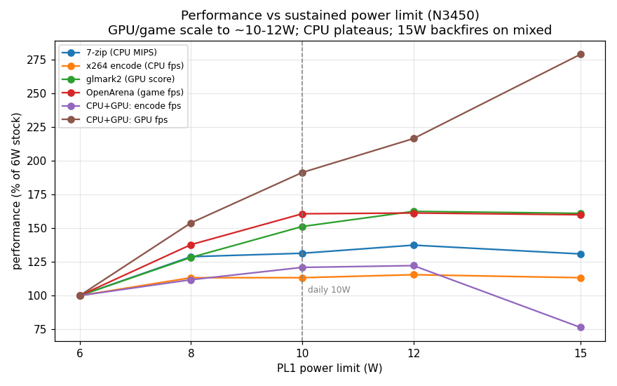
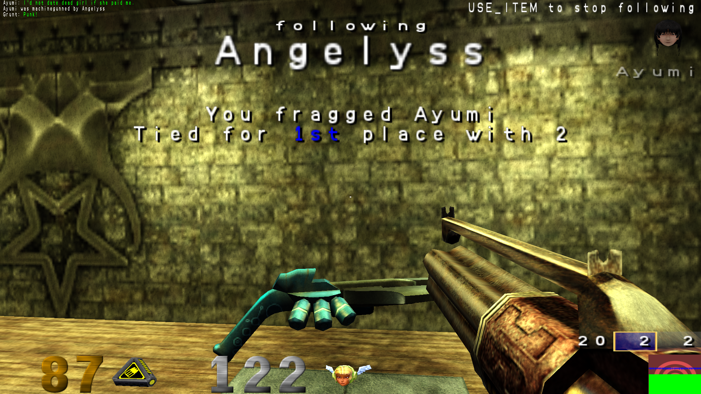

# Squeezing 10 watts out of a 6-watt netbook (Celeron N3450 / Apollo Lake)

I own a Jumper EZbook. It cost about as much as a fancy dinner, it has a Celeron
N3450, 6 GB of RAM, and the ambition of a tired snail. Under any sustained load
its four cores sag down to ~1.5 GHz and stay there, because Intel decided this
chip lives on a **6 watt** diet and the firmware enforces it with religious zeal.

This is the story of how I doubled that budget to **10 W** — and, more
interestingly, of all the walls I ran into face-first along the way. Because the
honest version of a hardware-hacking afternoon is not "I found the register." It
is "I found the wrong register, declared victory, declared defeat, declared
victory again, and only *then* found the right one." Buckle up, dear reader.

> **TL;DR for the impatient**
> - The PUnit enforces `PL1 = min(MMIO RAPL limit @0x70A8, MSR RAPL limit 0x610)`.
>   The firmware nails *both* to the fused 6 W TDP. You must raise **both**, and
>   the MSR one must be **locked**, or the GPU will quietly undo your work.
> - **The whole fix is two register writes at boot:**
>   1. MMIO `MCHBAR(0xFED10000)+0x70A8` := `0x00008f0000dd8a00`  (PL1 10 W / PL2 15 W)
>   2. MSR `0x610` := `0x80008f0000dd8a00`  (same, **+ bit 63 = LOCK**)
> - It works in **every** workload, GPU included: CPU-only **5.97 → 10.12 W**
>   (1.5 → 2.09 GHz), combined CPU+GPU **5.99 → 9.98 W**. Peak temp 84 °C against a
>   105 °C limit — this was never about heat, only policy.

## Show me the numbers

Real workloads, stock 6 W vs unlocked 10 W (full method and the 6→15 W sweep in
[BENCHMARKS.md](BENCHMARKS.md)):

| Workload | 6 W (stock) | 10 W (unlocked) | Gain |
|----------|-----------:|---------------:|:----:|
| OpenArena (game fps) | 69.1 | **111.0** | **+61 %** |
| glmark2 (GPU score) | 205 | **310** | **+51 %** |
| 7-zip (CPU MIPS) | 4858 | **6383** | **+31 %** |
| CPU+GPU mixed (glxgears fps) | 134 | **257** | **+91 %** |



The games and the mixed loads are the big winners. The pure-CPU stuff tops out
around 8–9 W because the all-core clock hits a hard ratio ceiling long before it
runs out of watts — which is exactly why 10 W, and not more, is the sweet spot.
Push to 15 W and you gain almost nothing and can even *lose* (more on that crime
later).



---

## The patient

- **Jumper EZbook**, Intel **Celeron N3450** (Apollo Lake / Goldmont, 4 cores,
  6 W TDP), 6 GB RAM, Intel HD Graphics 500.
- AMI Aptio UEFI. From earlier adventures I already knew how to read and write the
  SPI flash and the AMI `Setup` NVAR variable straight from Linux. That earlier
  work also taught me a brutal lesson that haunts this whole tale: **a lot of the
  knobs the BIOS proudly exposes are dead.** They sit in AMI's template, the menu
  shows them, you change them, you feel powerful — and the firmware never wires
  them to anything. (I learned this the hard way with the DVMT graphics-memory
  setting, which does precisely nothing.) Remember that. It comes back.
- **Clocks:** base 1.1 GHz, all-core burst capped at 2.1 GHz, single-core 2.2 GHz
  (`MSR 0x1AD = 0x15151516`). **TjMax = 105 °C** (`MSR 0x1A2 = 0x690000`) — a
  detail that will matter, because it means the 6 W cap is a *choice*, not a
  thermal necessity.

The itch: make the thing hold its turbo under load instead of crawling at 1.5 GHz.

---

## The investigation, dead ends and all

### Act 1 — The obvious lever. Wrong, of course.

Intel documents a package power limit MSR, `MSR_PKG_POWER_LIMIT` (`0x610`). I
decoded the factory value like a good citizen:

```
0x610 = 0x00008f0000dd8600
  PL1 (sustained) = 0x600 * (1/256 W) = 6.00 W, enabled
  PL2 (burst)     = 0xF00 * (1/256 W) = 15.00 W, enabled
  lock bit63      = 0   (not locked -> I can write it!)
```

Power unit confirmed via `MSR 0x606` (1/256 W), the kernel's `powercap` sysfs
agreed, the lock bit was clear. Easy. I wrote PL1 = 10 W:

```
0x610 := 0x00008f0000dd8a00   # PL1 = 0xA00 = 10 W
```

It read back perfectly. `powercap` cheerfully reported 10 W. I started a load,
rubbed my hands… and the package sat at **5.97 W**, cores at 1.5 GHz, with the
power-limit throttle flag (`THERM_STATUS`, `0x19C`) lit up like a Christmas tree.
The MSR was *obeyed by everyone except the hardware*. PCODE was overriding me.
First wall. 🧱

### Act 2 — The MMIO mirror. Right idea, wrong address.

On Core CPUs the limit is mirrored in MMIO at `MCHBAR + 0x59A0`, and the silicon
enforces the *lower* of MSR-vs-MMIO. This is the trick ThrottleStop and XTU use. I
found MCHBAR at PCI `0:0.0` offset `0x48` → base **`0xFED10000`**, and read
`0xFED159A0`:

```
MMIO @0xFED159A0 = 0x0000000000000000
```

Nothing. Zeros. "Ah," I said, with all the confidence of a man about to be wrong,
"there is no MMIO mirror on this chip." Hold that thought.

### Act 3 — Config-TDP. The chip just laughs.

```
0x648 CONFIG_TDP_NOMINAL : #GP
0x649 CONFIG_TDP_LEVEL1  : #GP
0x64A CONFIG_TDP_LEVEL2  : #GP
0x64B CONFIG_TDP_CONTROL : #GP
```

Every config-TDP MSR throws a general-protection fault. Apollo Lake simply doesn't
implement the feature. Next.

### Act 4 — The voltage regulator. Innocent.

`MSR 0x601 = 0xa8` ≈ 21 A current limit — comically far above anything 6 W needs.
Not the culprit.

### Act 5 — The BIOS knob that smells like a trap.

Digging through the extracted IFR (the AMI setup form), I found this beauty:

```
"TDP Limit"  Help: "Turbo-XE Mode Processor TDP Limit in Watts.
             0 means using the factory-configured value."   VarOffset 0xEC
```

A power limit, in watts, right there in the BIOS variable store! I set NVAR offset
`0xEC = 0x0A` (10 W) in both redundant Setup stores, EIST and Turbo enabled, and
**rebooted to test**, heart full of hope.

Result: **5.97 W**. Nothing. The field is gated behind `SuppressIf QID 0x352==0` —
a "Turbo-XE supported" flag that is `0` on this locked SKU — so the firmware never
feeds `0xEC` to the PUnit. The exact same dead-knob trap as DVMT. I should have
seen it coming. 😏

### Act 6 — In which I confidently surrender

So I wrote it up: *the 6 W limit is PCODE-locked, unreachable by any lever.* I even
committed that verdict to memory. Defeat, signed and dated.

It was, of course, completely wrong — and the only reason I reopened the case is
that someone refused to believe it. "I was quite sure we could do that," they said.
Annoyingly, that is exactly the kind of sentence that turns out to be right.

### Act 7 — Reopening the one read I never trusted

The weakest link was Act 2. A register that reads as *clean zeros* is suspicious —
real MMIO almost never does that. Two questions:

1. Is `/dev/mem` even letting me read MCHBAR? `CONFIG_STRICT_DEVMEM=y`, but on x86
   that still allows mmap of non-RAM holes (it would fail loudly with EPERM
   otherwise). The read path was legit.
2. Is MCHBAR actually *live*? I scanned the whole 32 KB window
   (`scripts/mchscan.py`): **764 non-zero dwords**, real data everywhere. Very
   much alive. Then I searched it for the RAPL signature (the PL2 word `0x8F00`):

```
+0x70A8 = 0x00008F0000DD8600   PL1=6.00W PL2=15.00W   <-- THERE IT IS
```

**The MMIO package-limit register on Apollo Lake lives at `0x70A8`, not the Core
`0x59A0`.** I had been reading an empty parking space three buildings over. It held
the factory 6 W, untouched by my Act-1 MSR write — and *this* was the one the
hardware actually obeys.

### Act 8 — Et voilà

```
0xFED170A8 := 0x00008F0000DD8A00   # PL1 = 10 W
```

| Metric | Before (6 W) | After (10 W) |
|--------|-------------:|-------------:|
| Steady-state power | 5.97 W | **10.12 W** |
| All-core clock | ~1.5 GHz | **2.09 GHz** |
| Package temp | 62 °C | 76 °C |

2.09 GHz is the all-core ratio ceiling, so for pure CPU this is as good as it gets.
I was a hero. For about ten minutes.

### Act 9 — "And does it help the GPU?" — a self-inflicted wound

First combined CPU+GPU test produced glorious nonsense: the "10 W" run drew 14.9 W,
the "15 W" run drew 9.9 W. Lower limit, higher power? Witchcraft?

No — sampling error. I measured 8–18 s into the load, smack inside the ~28 s **PL2
burst window**, where *both* runs are governed by the 15 W short-term limit, not
PL1. Measure PL1 and you must wait out the burst (>35 s). Embarrassing, fixed,
moving on.

### Act 10 — The GPU latch reveals itself

With an honest steady-state test (4 CPU workers + fullscreen glxgears):

```
[PL1=10W] pkg=5.99 W  GPU=200 MHz  CPU=1195 MHz
[PL1=15W] pkg=5.99 W  GPU=200 MHz  CPU=1195 MHz
```

Both pinned at **6 W**, CPU strangled back to 1.2 GHz — even though my `0x70A8`
still read 10 W, and i915 was *not* secretly rewriting it (I checked before,
during and after). The moment the GPU does anything, *something else* slams the
package back to the SoC TDP. I went hunting and found suspicious read-only
registers (`0x7870` ≈ 6 W, `0x70A0` = TDP 6 W), no writable per-plane MSRs
(`0x638`/`0x640` both `#GP`)… and concluded the GPU ceiling was baked into PCODE,
untouchable.

### Act 11 — The latch, and why your browser ruins everything

A per-second trace under pure CPU load (`data/timeseries-cpu-load.txt`) shows the
mechanism with cruel clarity:

```
 t  GPUmhz  CPUmhz  pkgW
 1-9   100   2089   ~10.0   GPU asleep (RC6) -> full 10 W, full turbo
10    300   1392    6.65    GPU twitches -> package collapses
16-30 ~100  ~1450   ~6.0    GPU asleep again... but power STAYS at 6 W
```

10 W holds **only while the GPU is in deep sleep**. The instant it wakes — to
composite a window, scroll a page, blink a cursor — the package drops to 6 W and
*stays there*, sulking, even after the GPU dozes off again. So Chrome, which keeps
the iGPU permanently caffeinated, would keep me at 6 W forever. The CPU win was
real only for headless, screen-idle grinding: compiling, encoding, compression.

And so, for the second time, I closed the case as unwinnable. Spoiler: the case
was not unwinnable.

### Act 12 — The breakthrough hiding in coreboot

Pushed (again) to look harder, I went and read the **coreboot** Apollo Lake source,
and there it was, stated outright in a commit message:

> *"This RAPL MMIO register is a physically separate instance from RAPL MSR
> register. The Punit algorithm constrains performance to whichever power limit is
> **lower** between both registers."* — and *"FSP code sets the PL1 value as 6 W in
> RAPL MMIO register based on fused soc tdp value."*

`PL1 = min(MMIO, MSR)`. Two separate registers. I had spent Act 8 onward smugly
holding the MMIO at 10 W… and never once re-checking the MSR. So I looked:

```
during GPU load:  MSR 0x610 = 0x...8600  (6 W!)   MMIO = 0x...8a00 (10 W)
```

**The MSR had been reset to 6 W.** The famous "GPU latch" was never some locked
fortress register — it was PCODE quietly resetting the *MSR* copy to 6 W whenever
the GPU stirs, and `min(10, 6) = 6`. The fortress was a sticky note.

Proof: re-writing the MSR to 10 W every second during a combined load held the
package at ~10 W. But the *elegant* fix is the MSR's own **lock bit (63)** — write
10 W with bit 63 set and PCODE can no longer touch it:

```
MSR 0x610 := 0x80008f0000dd8a00   # PL1 10 W, PL2 15 W, LOCKED
```

Combined CPU+GPU load, no daemon, no babysitting:

```
MSR during load : 0x80008f0000dd8a00  (held!)
package         : 9.98 W   (was 5.99)
GPU             : ~383 MHz (wide awake)
CPU             : ~1.57 GHz
```

`min(10 locked, 10) = 10`, GPU or no GPU. **Bonheur.** The unlock now applies to
games, video, browsing — everything. Two registers, one lock bit, and a great deal
of humility.

---

## The verdict

Enforcement is `PL1 = min(MMIO @0x70A8, MSR 0x610)`, so **both** must be raised —
and the MSR must be locked or the GPU resets it.

| Lever | Writable? | Role | Verdict |
|---|---|---|---|
| **MMIO `0x70A8` (package limit)** | **yes** | one half of the `min()` | **REQUIRED — raise to 10 W** |
| **MSR `0x610` PL1 + LOCK (bit 63)** | **yes** | other half; PCODE resets it on GT activity unless locked | **REQUIRED — raise to 10 W, locked** |
| MMIO `0x59A0` (Core offset) | n/a | — | wrong offset on Goldmont — the great red herring |
| MMIO `0x7870` / `0x70A0` | no | TDP/status read-outs | look like the GT limit, aren't — the 6 W came from the MSR reset |
| config-TDP `0x648–0x64C` | — | — | `#GP`, unimplemented |
| PP0/PP1 limit MSRs `0x638/0x640` | — | — | `#GP`, don't exist |
| BIOS NVAR "TDP Limit" `0xEC` | yes (flash) | — | not plumbed — a dead knob |

## Register map (MCHBAR base `0xFED10000`)

| Offset | Meaning | Notes |
|--------|---------|-------|
| `+0x70A0` | PKG_POWER_INFO (TDP) | 6 W, read-only read-out |
| `+0x70A8` | **PACKAGE_RAPL_LIMIT (MMIO)** | writable; `0x00008f0000dd8a00` = PL1 10 W / PL2 15 W |
| `+0x7870` | RAPL-shaped read-out (~6 W) | read-only red herring |

Plus MSR `0x610` (`PKG_POWER_LIMIT`): same qword layout, written with **bit 63
(lock)** set so PCODE can't reset it on GPU activity.

RAPL limit qword layout: bits `[14:0]` PL1 power (× 1/256 W), bit `15` PL1 enable,
bit `16` clamp, bits `[23:17]` time window, bits `[46:32]` PL2, bit `47` PL2
enable, bit `63` lock.

---

## Doing it yourself

Everything here needs root (it pokes `/dev/mem` and MSRs).

```bash
# apply the full fix now (both registers; volatile, gone on reboot)
sudo ./scripts/ezbook-pl1.py
#   -> MMIO 0x70A8 = 10 W  AND  MSR 0x610 = 10 W + lock

# just look at the current MMIO limit
sudo ./scripts/mmio_rapl.py

# set only the MMIO half (CPU-only boost; GPU loads still latch to 6 W)
sudo ./scripts/mmio_rapl.py 0x00008f0000dd8a00

# re-find the register on a different board / firmware
sudo ./scripts/mchscan.py

# generic MCHBAR peek/poke
sudo ./scripts/genpoke.py 70a8                 # read
sudo ./scripts/genpoke.py 70a8 0x...           # write
```

### Make it stick (systemd)

```bash
sudo install -m 0755 scripts/ezbook-pl1.py /usr/local/sbin/ezbook-pl1.py
sudo install -m 0644 systemd/ezbook-power-limit.service /etc/systemd/system/
sudo systemctl daemon-reload
sudo systemctl enable --now ezbook-power-limit.service
```

Both registers are volatile and the lock clears on reboot, so a tiny oneshot unit
re-applies the fix every boot. `ezbook-pl1.py` has no dependencies; confirm with
`systemctl status ezbook-power-limit.service`.

---

## What the 10 W actually buys you

It raises the **shared** package budget. Under a combined load the CPU and GPU now
split 10 W (e.g. CPU ~1.57 GHz + GPU ~383 MHz) instead of jointly suffocating at
6 W. It does **not** lift the per-domain ceilings — all-core CPU is still ratio-
capped at 2.1 GHz, the GPU at 700 MHz — but nothing is starved any more.

### Why not crank it to 15 W?

Because I tried, and measured it (the full sweep is in
[BENCHMARKS.md](BENCHMARKS.md)). Past 10 W the returns evaporate: CPU is flat
(ratio-capped), glmark2 gains a measly +7 % at 12 W then plateaus, the game is
already maxed at 10 W — and at **15 W it actively backfires on mixed loads**: with
a bigger budget and no per-domain limit, the uncapped GPU gorges itself and starves
the CPU encode down to *worse-than-10 W* numbers, all while running hottest (87 °C).
More watts, less work, more heat. 10 W is the honest optimum, which is why the
daily config stops there. If you insist on experimenting, the target in
`ezbook-pl1.py` is one constant away (PL1 = 12 W → MMIO `0x00008f0000dd8c00`, MSR
`0x80008f0000dd8c00`).

---

## The toolbox (`scripts/`)

| Script | What it does |
|--------|--------------|
| `mmio_rapl.py` | show / write the MMIO package RAPL limit at `0x70A8` |
| `mchscan.py` | scan 32 KB MCHBAR for liveness + the RAPL signature (re-find the register) |
| `dumpregs.py` | dump the region around `0x70A8` and hunt limit-shaped qwords |
| `genpoke.py` | generic MCHBAR qword peek/poke by offset |
| `nvar.py` | read/write the AMI `Setup` NVAR variable in SPI flash |
| `peek.py` | print selected NVAR Setup offsets (EIST/Turbo/TDC/TDP) |
| `benchsuite.sh` / `runladder.sh` / `runladder2.sh` | the benchmark harness and the 6→15 W ladders |
| `reassert_msr.py` | re-assert an unlocked MSR (for the >10 W sweep) |
| `plot_benchmarks.py` | regenerate the plots from the raw data |
| `ezbook-pl1.py` | the boot-time applier: MMIO 10 W + MSR 10 W locked |

## Before you go poking

- Everything runtime is **volatile** — a reboot restores the factory 6 W, lock and
  all. The only thing that touches flash is `nvar.py`, and we already established
  the NVAR power knob is a dud.
- TjMax is 105 °C; I measured ≤ 84 °C even at 15 W. Thermals were never the limit
  on this chassis — but if yours is hotter, watch `THERM_STATUS` (`MSR 0x19C`) and
  the thermal zones.
- `/dev/mem` pokes are a loaded gun. The wrong MCHBAR offset can hang the machine
  instantly. Every address here is specific to **Apollo Lake (N3450)** — run
  `mchscan.py` before trusting any of it on different silicon.

Three buildings over, an empty parking space still reads `0x0000000000000000`.
Don't trust the first clean zero you meet. 🙂
